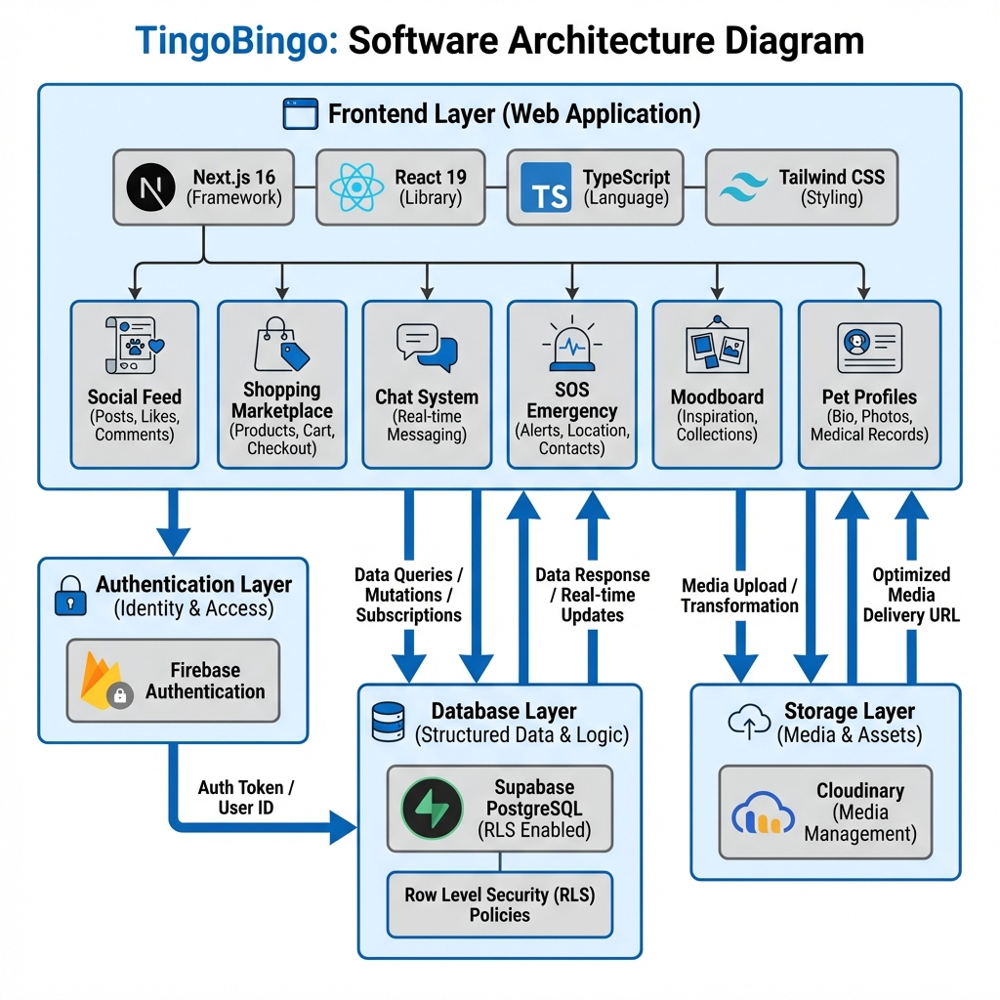

# TingoBingo

<div align="center">
  
  
  ### A Feature-Rich Social Platform for Pet Lovers
  
  
  
  
  
  
  **[Live Demo](https://tingo-bingo.vercel.app/)** | **[Report Bug](https://github.com/labonysur-cloud/Tingo-Bingo/issues)** | **[Request Feature](https://github.com/labonysur-cloud/Tingo-Bingo/issues)**
</div>

---

## Table of Contents

- [About](#about)
- [Key Features](#key-features)
- [Architecture](#architecture)
- [Tech Stack](#tech-stack)
- [Getting Started](#getting-started)
- [Database Setup](#database-setup)
- [Environment Variables](#environment-variables)
- [Project Structure](#project-structure)
- [Contributing](#contributing)
- [License](#license)

---

## About

**TingoBingo** is a comprehensive social media and marketplace platform designed exclusively for pet owners and animal lovers. It combines social networking features with e-commerce capabilities, emergency services, and AI-powered tools to create a complete ecosystem for the pet community.

The platform enables users to share moments with their pets, connect with other pet owners, buy and sell pet products, access emergency veterinary services, and utilize AI assistance for pet care recommendations.

---

## Key Features

### Social Networking
- **Posts & Feed**: Share photos and updates about your pets with the community
- **Stories & Highlights**: Create temporary stories (24h) and permanent highlight collections
- **Comments & Likes**: Engage with posts through nested comments and reactions
- **Moodboard**: Save and organize favorite posts in a Pinterest-style grid
- **Follow System**: Build your network by following other pet owners

### Pet Profiles
- **Multiple Pets**: Add and manage profiles for all your pets
- **Detailed Information**: Track breed, age, gender, medical records, and more
- **Primary Pet**: Designate one pet as your primary profile companion
- **Rich Media**: Upload photos and create comprehensive pet biographies

### Shopping Marketplace
- **Product Listings**: Buy and sell pet supplies, accessories, and services
- **Shopping Cart**: Add items and manage purchases
- **Product Reviews**: Rate and review purchased products
- **Seller Profiles**: View seller information and ratings

### Communication
- **Real-Time Chat**: Private messaging with other users
- **Message History**: Browse conversation history with search functionality
- **Typing Indicators**: See when users are typing
- **Online Status**: View user availability

### Emergency Services (SOS)
- **Emergency Contacts**: Quick access to veterinary services
- **Location-Based**: Find nearby emergency facilities
- **Contact Information**: Phone numbers, addresses, and operating hours

### AI Integration
- **Zoothopilia AI**: Get pet care recommendations and advice
- **Smart Responses**: AI-powered suggestions for pet-related queries

### Gaming & Entertainment
- **Pet Arcade**: Fun mini-games for pet owners
- **Contests**: Participate in community contests

### User Management
- **Profile Customization**: Edit bio, location, and avatar
- **Settings**: Manage account preferences
- **Notifications**: Real-time updates for interactions

---

## Architecture



### Frontend Layer
- **Framework**: Next.js 16 with App Router
- **UI Library**: React 19 with TypeScript
- **Styling**: Tailwind CSS with custom components
- **State Management**: React Context API
- **Icons**: Lucide React

### Authentication Layer
- **Provider**: Firebase Authentication
- **Features**: Email/password login, session management
- **Security**: Protected routes and user context

### Database Layer
- **Platform**: Supabase (PostgreSQL)
- **Security**: Row Level Security (RLS) policies
- **Real-time**: Live subscriptions for chat and notifications
- **Schema**: Comprehensive relational database design

### Storage Layer
- **Service**: Cloudinary
- **Media Types**: Images, videos, avatars
- **Optimization**: Automatic image transformation and delivery

---

## Tech Stack

### Core Technologies
| Technology | Version | Purpose |
|------------|---------|---------|
| Next.js | 16.1.6 | React framework with SSR/SSG |
| React | 19.2.3 | UI library |
| TypeScript | 5.0 | Type-safe development |
| Tailwind CSS | 4.0 | Utility-first styling |

### Backend Services
| Service | Purpose |
|---------|---------|
| Supabase | PostgreSQL database, authentication, real-time |
| Firebase | Additional authentication services |
| Cloudinary | Media storage and CDN |

### Key Libraries
- **lucide-react** - Icon components
- **react-hot-toast** - Toast notifications
- **date-fns** - Date formatting and manipulation
- **react-leaflet** - Interactive maps for SOS
- **clsx** - Conditional className utility

---

## Getting Started

### Prerequisites
- Node.js 18+ and npm/yarn/pnpm
- Supabase account
- Firebase account
- Cloudinary account

### Installation

1. **Clone the repository**
```bash
git clone https://github.com/labonysur-cloud/Tingo-Bingo.git
cd Tingo-Bingo
```

2. **Install dependencies**
```bash
npm install
# or
yarn install
```

3. **Set up environment variables**
```bash
cp .env.example .env.local
```
Edit `.env.local` with your credentials (see [Environment Variables](#environment-variables))

4. **Set up the database**
Run the SQL scripts in order:
```bash
# 1. Run the main schema
# Copy and execute supabase-final-schema.sql in Supabase SQL Editor

# 2. Fix RLS policies and add features
# Execute complete-fix-posts-products-save.sql
```

5. **Run the development server**
```bash
npm run dev
```

6. **Open your browser**
Navigate to [http://localhost:3000](http://localhost:3000)

---

## Database Setup

The project uses Supabase as the database. Follow these steps:

1. **Create a new Supabase project** at [supabase.com](https://supabase.com)

2. **Execute SQL scripts in order**:
   - `supabase-final-schema.sql` - Main database schema
   - `complete-fix-posts-products-save.sql` - RLS policies and additional features
   - `step2_create_products.sql` - Product marketplace tables

3. **Configure Row Level Security**:
   - RLS policies are included in the SQL scripts
   - Policies allow public read access for browse functionality
   - Write operations require authentication

4. **Enable Realtime**:
   - Enable realtime for `chats`, `messages`, `notifications` tables
   - This enables live updates for chat and notifications

---

## Environment Variables

Create a `.env.local` file in the root directory:

```env
# Supabase
NEXT_PUBLIC_SUPABASE_URL=your_supabase_url
NEXT_PUBLIC_SUPABASE_ANON_KEY=your_supabase_anon_key

# Firebase
NEXT_PUBLIC_FIREBASE_API_KEY=your_firebase_api_key
NEXT_PUBLIC_FIREBASE_AUTH_DOMAIN=your_firebase_auth_domain
NEXT_PUBLIC_FIREBASE_PROJECT_ID=your_firebase_project_id
NEXT_PUBLIC_FIREBASE_STORAGE_BUCKET=your_firebase_storage_bucket
NEXT_PUBLIC_FIREBASE_MESSAGING_SENDER_ID=your_firebase_sender_id
NEXT_PUBLIC_FIREBASE_APP_ID=your_firebase_app_id

# Cloudinary
NEXT_PUBLIC_CLOUDINARY_CLOUD_NAME=your_cloud_name
NEXT_PUBLIC_CLOUDINARY_API_KEY=your_api_key
CLOUDINARY_API_SECRET=your_api_secret
```

---

## Project Structure

```
TingoBingo/
├── src/
│   ├── app/                    # Next.js app router pages
│   │   ├── (auth)/            # Authentication pages
│   │   ├── chat/              # Chat interface
│   │   ├── moodboard/         # Saved posts
│   │   ├── profile/           # User profiles
│   │   ├── shop/              # Marketplace
│   │   ├── sos/               # Emergency services
│   │   └── layout.tsx         # Root layout
│   ├── components/            # React components
│   │   ├── feed/              # Social feed components
│   │   ├── profile/           # Profile components
│   │   ├── shop/              # Shopping components
│   │   ├── chat/              # Chat components
│   │   ├── layout/            # Layout components
│   │   └── ui/                # Reusable UI components
│   ├── context/               # React Context providers
│   │   ├── AuthContext.tsx    # Authentication state
│   │   ├── SocialContext.tsx  # Posts, likes, comments
│   │   └── ChatContext.tsx    # Chat functionality
│   └── lib/                   # Utilities and configs
│       ├── firebase.ts        # Firebase configuration
│       ├── supabase.ts        # Supabase client
│       └── cloudinary.ts      # Cloudinary utilities
├── public/                    # Static assets
├── docs/                      # Documentation
└── SQL scripts/               # Database setup files
```

---

## Contributing

Contributions are welcome! Please follow these steps:

1. Fork the repository
2. Create your feature branch (`git checkout -b feature/AmazingFeature`)
3. Commit your changes (`git commit -m 'Add some AmazingFeature'`)
4. Push to the branch (`git push origin feature/AmazingFeature`)
5. Open a Pull Request

---

## License

This project is licensed under the MIT License - see the [LICENSE](LICENSE) file for details.

---

## Acknowledgments

- Built with [Next.js](https://nextjs.org/)
- Database powered by [Supabase](https://supabase.com/)
- Media storage by [Cloudinary](https://cloudinary.com/)
- Icons from [Lucide](https://lucide.dev/)

---

<div align="center">
  <p>Made with ❤️ for pet lovers everywhere</p>
  <p>
    <a href="https://tingo-bingo.vercel.app/">View Live Demo</a> •
    <a href="https://github.com/labonysur-cloud/Tingo-Bingo/issues">Report Bug</a> •
    <a href="https://github.com/labonysur-cloud/Tingo-Bingo/issues">Request Feature</a>
  </p>
</div>
